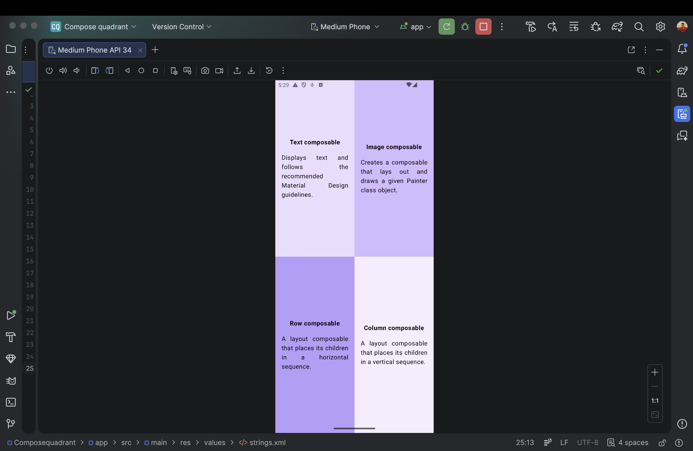

# Compose Quadrant App

A Jetpack Compose application demonstrating a 4-quadrant layout using Row, Column, and Modifier.weight.

## 📱 Overview

This app divides the screen into four equal sections.  
Each quadrant explains a fundamental Jetpack Compose component:

- Text composable
- Image composable
- Row composable
- Column composable

## 🛠 Built With

- Kotlin
- Jetpack Compose
- Android Studio

## 🎯 Concepts Practiced

- Row & Column layout
- Modifier.weight()
- fillMaxSize()
- background colors
- Padding & alignment
- FontWeight.Bold
- TextAlign.Justify
- Reusable composables

## 📸 Screenshot

---

👨‍💻 Developed by Fahad Umar Farooq
